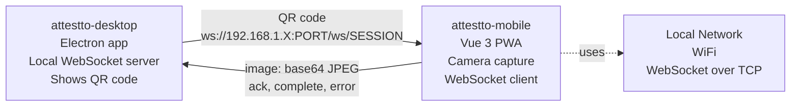

# attestto-mobile

> Camera companion PWA for attestto-desktop — your phone becomes the document and selfie capture device. Images travel over local WiFi via WebSocket. No server, no cloud, no PII transmitted outside your local network.

Attestto Mobile is a Progressive Web App deployed at [mobile.attestto.com](https://mobile.attestto.com). It solves a specific problem: desktop webcams are terrible for identity document capture. A phone camera is much better. This app turns your phone into a dedicated camera for the Attestto desktop app, all over your local network.

## Architecture



**Flow:**
1. Desktop generates QR code with WebSocket URL
2. Phone scans QR → opens this PWA with the URL
3. PWA connects to desktop via WebSocket
4. User captures document front, back, selfie
5. Each image sent as base64 JPEG to desktop
6. Desktop acknowledges each step; PWA advances
7. Done → prompt to install PWA to home screen

## Quick start

### Prerequisites

- Node.js 18+
- pnpm
- HTTPS (required for `getUserMedia` — GitHub Pages provides this, or use `localhost:5173` in dev)

### Install

```bash
pnpm install
pnpm dev      # Starts on https://localhost:5173
```

### Try it

1. Open https://localhost:5173 (note: HTTPS required for camera access)
2. Click to open the QR reader
3. Scan a QR code (or paste a WebSocket URL to test)
4. Capture: phone → document front → document back → selfie

Build and deploy:

```bash
pnpm build    # Creates dist/ for GitHub Pages
```

Deployed automatically on push to `main` via `.github/workflows/deploy.yml`.

## Key concepts

### Capture flow

**Step 1 — Document front**
Card frame overlay. User aligns document within the frame. Tap to capture, or use auto-capture if supported.

**Step 2 — Document back**
Same card frame overlay.

**Step 3 — Selfie + passive liveness**
Face oval overlay. Blink detection (passive liveness check — no active user prompts).

If camera access is blocked, file input fallback is available at each step.

After all 3 steps: success screen with prompt to install PWA to home screen.

### WebSocket message protocol

All messages are JSON over WebSocket. The QR code URL format:

```
https://mobile.attestto.com/capture?ws=ws://192.168.1.X:PORT/ws/SESSION_ID
```

The PWA extracts `ws=` from the query string and connects immediately.

**Message types:**

```typescript
// Phone → Desktop
{
  type: 'image',
  step: 'front' | 'back' | 'selfie',
  data: '<base64 JPEG string>',  // URL-safe base64
}

// Desktop → Phone
{
  type: 'ack',
  step: 'front' | 'back' | 'selfie',
}

// Desktop → Phone (all steps complete)
{
  type: 'complete',
}

// Desktop → Phone (error, stop capture)
{
  type: 'error',
  message: 'description of error',
}
```

### Stack

- **Vue 3 + TypeScript** — Reactive, type-safe UI
- **Vite + vite-plugin-pwa** — Fast dev, installable PWA
- **Tailwind CSS** — Utility styling
- **WebSocket** — Real-time connection to desktop (`ws://`)
- **WebAPI `getUserMedia`** — Camera access
- **GitHub Pages** — HTTPS deployment (required for `getUserMedia`)

### Privacy and security

- Images are captured locally on your phone
- Images travel directly to your own desktop over your local WiFi
- No intermediate server, no cloud storage, no PII leaves your home network
- All processing (OCR, liveness detection, credential storage) happens on your desktop

## Ecosystem

| Repo | Role | Relationship |
|------|------|--------------|
| [`attestto-desktop`](../attestto-desktop) | Electron station | Receives images from this PWA, runs OCR and liveness checks |
| [`attestto-app`](../attestto-app) | Citizen wallet | Where users manage credentials captured via this PWA |

## Build with an LLM

This repo ships a [`llms.txt`](./llms.txt) context file — a machine-readable summary of the API, data structures, and integration patterns designed to be read by AI coding assistants.

### Recommended setup

Use the [`attestto-dev-mcp`](../attestto-dev-mcp) server to give your LLM active access to the ecosystem:

```bash
cd ../attestto-dev-mcp
npm install && npm run build
```

Then add it to your Claude / Cursor / Windsurf config and ask:

> *"Explore the Attestto ecosystem and help me extend [this component]"*

### Which model?

We recommend **[Claude](https://claude.ai) Pro** (5× usage vs free) or higher. Long context and Vue 3 / WebSocket expertise handle this codebase well. The MCP server works with any LLM that supports tool use.

> **Quick start:** Ask your LLM to read `llms.txt` in this repo, then describe what you want to build. It will find the right archetype, generate boilerplate, and walk you through the first run.

## Contributing

```bash
pnpm install    # Install dependencies
pnpm dev        # Start dev server with HTTPS
pnpm build      # Build for deployment
pnpm lint       # ESLint + Prettier
pnpm test       # vitest
```

Contributions welcome. All code Apache 2.0.

## License

[Apache 2.0](./LICENSE) — Use it, fork it, deploy it.

Built by [Attestto](https://attestto.com) as Public Digital Infrastructure for Costa Rica and beyond.
